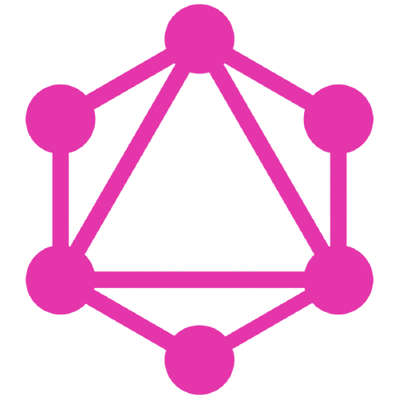

<h1><strong>Hi👋</strong></h1>

# I'm Joel 

Am a software developer.
I love writing technical articles and when am not writing, am contributing to open source and working on my personal projects.

Some of the things I've been working on include:

## My Skills

      

## Tools I Use

  

## Where I Hangout

## What I've been up to

